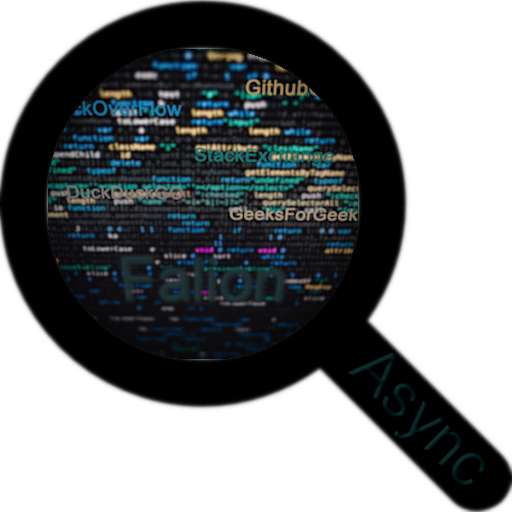

<div id="top"></div>
<a name="readme-top"></a>

[![Contributors][contributors-shield]][contributors-url]
[![Forks][forks-shield]][forks-url] [![Stargazers][stars-shield]][stars-url]
[![Issues][issues-shield]][issues-url]
[![MIT License][license-shield]][license-url]
[![Crates.io][crates-shield]][crates-url]

<!-- PROJECT LOGO -->
<br />
<div align="center">
  

<h1 align="center"></h1>

<p align="center">
    An open source, programmed in rust, privacy focused tool for scraping programming resources (like stackoverflow) fast, efficient and asynchronous/parallel using the CLI or GUI.
    <p>
        <a href="https://github.com/Obscurely/falion/wiki"><strong>Explore the docs »</strong></a>
        <br />
        <br />
        <a href="https://github.com/Obscurely/falion#-video-showcase">View Demo</a>
        ·
        <a href="https://github.com/Obscurely/falion/issues">Report Bug</a>
        ·
        <a href="https://github.com/Obscurely/falion/issues">Request Feature</a>
    </p>
  </p>
</div>

<!-- TABLE OF CONTENTS -->
<details>
  <summary>Table of Contents</summary>
  <ol>
    <li>
      <a href="# -about-the-project">About The Project</a>
      <ul>
        <li><a href="#key-highlights">Key Highlights</a></li>
        <li><a href="#supported-resources">Supported Resources</a></li>
        <li><a href="#-features">💡 Features</a></li>
        <li><a href="#-video-showcase">🎥 Video showcase</a></li>
        <li><a href="#-built-with">🍔 Built with</a></li>
        <ul>
          <li><a href="#the-stock-libraries-and-these-awesome-third-party-ones">The stock libraries and these awesome third-party party ones</a></li>
        </ul>
      </ul>
    </li>
    <li>
      <a href="#-getting-started">🏁 Getting Started</a>
      <ul>
        <li><a href="#-running-the-program">🏃 Running the Program</a></li>
        <ul>
          <li><a href="#-windows">🪟 Windows</a></li>
          <ul>
            <li><a href="#portable-exe">Portable EXE</a></li>
            <li><a href="#installer">Installer</a></li>
          </ul>
          <li><a href="#-linux">🐧 Linux</a></li>
          <ul>
            <li><a href="#portable-bin">Portable Bin</a></li>
            <li><a href="#appimage">AppImage</a></li>
            <li><a href="#aur">AUR</a></li>
            <li><a href="#nix-file">Nix File</a></li>
            <li><a href="#deb-file">Deb File</a></li>
            <li><a href="#arch-pkg-file">Arch Pkg File</a></li>
          </ul>
          <li><a href="#-macos">🍎 MacOS</a></li>
          <ul>
            <li><a href="#portable-binary">Portable Bin</a></li>
            <li><a href="#app-folder">App Folder</a></li>
            <li><a href="#dmg-installer">DMG Installer</a></li>
            <li><a href="#homebrew">Homebrew</a></li>
          </ul>
          <li><a href="#-all-platforms">🚉 All Platforms</a></li>
        </ul>
        <li><a href="#-compilation">🛠 Compilation</a></li>
      </ul>
    </li>
    <li>
      <a href="#-usage">🪧 Usage</a>
      <ul>
        <li><a href="#basics">Basics</a></li>
        <li><a href="#advanced">Advanced</a></li>
      </ul>
    </li>
    <li><a href="#-road-map">🗾 Road Map</a></li>
    <li><a href="#-contributing">💁 Contributing</a></li>
    <li><a href="#faq">❓ FAQ</a></li>
    <li><a href="#-semver">📟 Semver</a></li>
    <li><a href="#-security">🔰 Security</a></li>
    <li><a href="#-license">🪪 License</a></li>
    <li><a href="#-contact">📧 Contact</a></li>
    <li><a href="#-template">📄 Template</a></li>
    <li><a href="#-acknowledgments">🦾 Acknowledgments</a></li>
  </ol>
</details>

## 🪽 About The Project

**Falion** is creative open-source tool created in **Rust** with the aim of
improving programming **resource scraping**. It prioritizes **privacy**,
**speed**, and **efficiency**, targeting sources like **StackOverflow**,
**GitHub Gists**, and more.

The project aims to solve the challenges of accessing information **quickly**
and **privately** in the programming world, using **DuckDuckGo** for **secure**,
**private** search results. **HTTPS-only** connections & **no JavaScript**,
**plain HTML**.

**Falion** is **lightning-fast** and **efficient**, with **asynchronous** result
retrieval and **parallel** scraping. It takes **only about 1-1.5 seconds** to
obtain five results from each resource. **Meaning, by the time you see the
results everything is already loaded and ready to be accessed**.

It offers user-centric interfaces, including a **Command Line Interface (CLI)**
with VIM-like key bindings (where applicable) and a **Graphical User Interface
(GUI)**.

**Cross-platform** support ensures that it runs on **Linux**, **MacOS**, and
**Windows**.

It can be used as a standalone tool or integrated into Rust projects **as a
crate**, enhancing development capabilities.

---

**Key Highlights**

**Privacy First:** It utilizes DuckDuckGo for results, stick to HTTPS-only
connections, and keep it tracker-free.

**Blazing Speed:** Thanks to asynchronous result retrieval and parallel
scraping, you get your answers in a snap.

**User-Centric Interfaces:** Choose between a VIM-like (where applicable) CLI or
a lightweight GUI for your preferred experience.

**Cross-Platform:** Works seamlessly on Linux, MacOS, and Windows.

**No Rate Limitations:** Scraping without interruptions under normal use.

**Versatile:** Use it as a stand-alone tool or integrate it as a crate into your
Rust projects.

---

**Supported Resources**

These are generic resources that work for most popular languages. In the future
there will be more added + custom resources support. Also
[request resources here](https://github.com/Obscurely/falion/discussions/15).

- [StackOverflow](https://stackoverflow.com/) is a programming Q&A website.
- [StackExchange](https://stackexchange.com/) is a network of community-driven
  Q&A websites.
- [GitHub Gists](https://gist.github.com/) are a platform for sharing and
  collaborating on code snippets.
- [GeeksForGeeks](https://www.geeksforgeeks.org/) is an online learning platform
  for computer science and programming.
- [DuckDuckGo Results](https://duckduckgo.com/) are just your normal results
  rendered as text, not as nice as the above, as a last resort.

If you've got any questions please give the [FAQ](#faq) a check.

<p align="right">(<a href="#readme-top">back to top</a>)</p>

### 💡 Features

- [x] Scrapes programming resources
  - [x] **StackOverflow** - No need to say anything
  - [x] **StackExchange**- index of different forums
  - [x] **Github Gists** - for code snippets and guides
  - [x] **GeeksForGeeks** - has various good programming resources
  - [x] **DuckDuckGo** - just so you don't need to leave the program you also
        have html versions of the basic results
- [x] **Privacy** focused
  - [x] DuckDuckGo used for results
  - [x] HTTPs only requests
  - [x] Only fetches HTML, no unnecessary tracking
- [x] Incredibly **fast** and **efficient**
  - [x] Results are retrieved **asynchronously**
  - [x] Resources are scraped in **parallel**
  - [x] Instantly view a page, by the time **results appear the content is
        already loaded**
  - [x] **Takes about 1 second to 1 and a half to get the results (& content). 5
        results each resource**
  - [x] Leverages rust's performance
  - [x] Many **optimizations** done
  - [x] Ligthweight on resources (GUI and CLI)
- [x] CLI interface
  - [x] **Fast** and render optimized interface
  - [x] **VIM** like key binds (where applicable)
  - [x] **Simple** and **intuitive**
- [x] GUI interface
  - [x] **Ligthweight** interface
  - [x] **Simple**
  - [x] **Responsive**
- [x] Cross-platform
  - [x] **Linux**
  - [x] **MacOS**
  - [x] **Windows**
- [x] **Doesn't get you rate limited**, _under normal use_
- [x] Project can also **be used as a crate**
- [ ] Results are **cached** for up to 7 days
- [ ] **Web UI**
- [ ] **Custom resources** support
- [ ] **Configurable**
  - [ ] Config file editable from the program

<p align="right">(<a href="#readme-top">back to top</a>)</p>

### 🎥 Video showcase

[Showcase](CHANGEME_MANUAL) <!-- Showcase video uploaded to github -->

<p align="right">(<a href="#readme-top">back to top</a>)</p>

### 🍔 Built with

- [Rust 1.72.1](https://www.rust-lang.org/)

<p align="right">(<a href="#readme-top">back to top</a>)</p>

#### The stock libraries and these awesome third-party ones

- [chrono](https://lib.rs/crates/chrono) for the names of the log file
- [clap](https://lib.rs/crates/clap) for cli arguments
- [crossterm](https://lib.rs/crates/crossterm) is at at the heart of the cli
- [dashmap](https://lib.rs/crates/dashmap) is a concurent hashmap
- [dirs](https://lib.rs/crates/dirs) for getting where to store log files
- [futures](https://lib.rs/crates/futures) for parallel execution
- [hashbrown](https://lib.rs/crates/hashbrown) is the std hashmap, but with a
  much faster hash
- [html2text](https://lib.rs/crates/html2text) for making html readable as text
- [rand](https://lib.rs/crates/fastrand) for generating a random user agent
- [rayon](https://lib.rs/crates/rayon) for parallel iterators
- [reqwest](https://lib.rs/crates/reqwest) for making web requests
- [slint](https://lib.rs/crates/slint) for the GUI
- [slint-build](https://lib.rs/crates/slint-build) for building the gui files
- [thiserror](https://lib.rs/crates/thiserror) for making error handling better
- [tokio](https://lib.rs/crates/tokio) is an asynchronous runtime
- [tracing](https://lib.rs/crates/tracing) for getting logs
- [tracing-subscriber](https://lib.rs/crates/tracing-subscriber) for parsing and
  storing the logs
- [url](https://lib.rs/crates/url) for parsing urls to test if they are valid
- [urlencoding](https://lib.rs/crates/urlencoding) for encoding search queries
- [user32-sys](https://lib.rs/crates/user32-sys),
  [winapi](https://lib.rs/crates/winapi) and
  [kernel32-sys](https://lib.rs/crates/kernel32-sys) for checking where the
  program was run from and hiding the terminal window on windows
- [embed-resource](https://lib.rs/crates/embed-resource) for embeding the icon
  in the executable on build on windows

<p align="right">(<a href="#readme-top">back to top</a>)</p>

## 🏁 Getting Started

### 🏃 Running The Program

| Platform                         | Versions        |
| :------------------------------- | :-------------- |
| [Windows](#-windows)             | 7 and above     |
| [Linux](#-linux)                 | Anything really |
| [MacOS](#-macos)                 | 10.15 and above |
| [All Platforms](#-all-platforms) | All the above   |

<p align="right">(<a href="#readme-top">back to top</a>)</p>

---

### 🪟 Windows

- [Portable EXE](#portable-exe)
- [Installer](#installer)

#### Portable EXE

1. Go to the [Releases Tab](https://github.com/Obscurely/falion/releases) and
   download the _falion-windows.exe_ file (might have to click show all).
1. Double click the exe you just downloaded and there you go the program works.
1. Might wanna take a look at the [Usage Tab](#-usage) if you don't understand
   something about it.
1. Also you might wanna make a desktop shortcut and one to place in the
   [start-menu](https://www.windowscentral.com/add-app-shortcuts-start-menu-manually-windows-10)

#### Installer

1. Go to the [Releases Tab](https://github.com/Obscurely/falion/releases) and
   download the _falion-windows-installer.exe_ file (might have to click show
   all).
1. Double click the installer and go through it as you would with any other
   installer.
1. If you look now in the start menu (or on the desktop if you ticked create
   desktop shortcut) you are gonna see a shortcut for falion, just run it like
   any other program.
1. Might wanna take a look at the [Usage Tab](#-usage) if you don't understand
   something about it.

<p align="right">(<a href="#readme-top">back to top</a>)</p>

---

### 🐧 Linux

- [Portable Bin](#portable-bin)
- [AppImage](#appimage)
- [AUR](#aur)
- [Nix File](#nix-file)
- [Deb File](#deb-file)

**⚠️ Dependencies:** openssl, most likely already installed.

<p align="right">(<a href="#readme-top">back to top</a>)</p>

#### Portable Bin

1. Go to the [Releases Tab](https://github.com/Obscurely/falion/releases) and
   download the _falion-linux_ file.
1. Double click the bin you just downloaded and there you go the program works.
1. Might wanna take a look at the [Usage Tab](#-usage) if you don't understand
   something about it.
1. Also you might wanna download _falion-linux.tar.gz_ file instead and extract
   linux/desktop/falion.desktop to $HOME/.local/share/applications,
   linux/desktop/icons to $HOME/.local/share/icons in order to have a start-menu
   shortcut and falion to /usr/bin/.

#### AppImage

1. Go to the [Releases Tab](https://github.com/Obscurely/falion/releases) and
   download the _falion-linux.AppImage_ file.
1. Double click the AppImage you download and there you go the program just
   works. You may want to install
   [AppImageLauncher](https://github.com/TheAssassin/AppImageLauncher) if you
   don't have it already, so when you start the AppImage you'll get a prompt
   asking if you want to integrate and run it and if you do so it will appear
   just as if you installed it.
1. Might wanna take a look at the [Usage Tab](#-usage) if you don't understand
   something about it.

#### AUR

The PKGs are:

- falion (for stable)
- falion-bin (for precompiled)
- falion-git (to compile from the latest source code commit)

a. if you have an AUR manager (like
[paru](https://github.com/Morganamilo/paru/blob/master/README.md#installation)
or [yay](https://github.com/Jguer/yay/blob/next/README.md#installation), which
you should)

1. Just like with any other AUR pkg choose your prefered type and you can run
   the following command for example.

   ```shell
   paru -Sy falion
   ```

1. Search for falion in your app launcher and launch it.
1. Might wanna take a look at the [Usage Tab](#-usage) if you don't understand
   something about it.

b. Manually cloning and building it from AUR

1. First install the basic build dependencies, if you don't already have them:

   ```shell
   sudo pacman -Sy gcc base-devel --needed
   ```

1. Then clone the build script

   ```shell
   git clone https://aur.archlinux.org/falion.git # or falion-bin & falion-git
   ```

1. Cd into the new cloned repository and run the following to build the package

   ```shell
   makepkg
   ```

1. In order to install the package run the following (where \* is just an any
   other characters place holder)

   ```shell
   sudo pacman -U falion-*.pkg.tar.zst
   ```

#### Nix File

You are using NixOS, don't worry I got you bro.

1. Go to the [Releases Tab](https://github.com/Obscurely/falion/releases) and
   download the _falion-linux.nix_ file.
1. If you use flakes then put it in your pkgs folder, and up-top add your tag
   (like _my_). If you don't just add the code in your default.nix file and
   install it this way.
1. Might wanna take a look at the [Usage Tab](#-usage) if you don't understand
   something about it.

#### Deb File

You should use the app image. This does not provide a desktop file, you'll have
to run it from the command-line. It's here just as another means if needed. I
will try to make a ppa eventually.

1. Go to the [Releases Tab](https://github.com/Obscurely/falion/releases) and
   download the _falion-linux.deb_ file.
1. Open a terminal in the folder where your download is and run the following
   command:

   ```shell
   sudo dpkg -i falion-linux.deb
   ```

1. Run _falion_ in the terminal and there it is, the app.
1. Might wanna take a look at the [Usage Tab](#-usage) if you don't understand
   something about it.
1. Also you might wanna download _falion-linux.tar.gz_ file instead and extract
   linux/desktop/falion.desktop to $HOME/.local/share/applications and
   linux/desktop/icons to $HOME/.local/share/icons in order to have a start-menu
   shortcut.

<p align="right">(<a href="#readme-top">back to top</a>)</p>

---

### 🍎 macOS

- [Portable binary](#portable-binary)
- [App Folder](#app-folder)
- [DMG Installer](#dmg-installer)
- [Homebrew](#homebrew)

<p align="right">(<a href="#readme-top">back to top</a>)</p>

#### Portable binary

1. Go to the [Releases Tab](https://github.com/Obscurely/falion/releases) and
   download the _falion-macos_ file.
1. Double click the bin you just downloaded and there you go the program works.
1. Might wanna take a look at the [Usage Tab](#-usage) if you don't understand
   something about it.
1. Also you might wanna place it somewhere special and
   [create a shortuct](https://www.lifewire.com/create-desktop-shortcuts-on-a-mac-5184827)

#### App Folder

Damn simillar to [portable binary](#portable-binary), only real difference is
this has an icon.

1. Go to the [Releases Tab](https://github.com/Obscurely/falion/releases) and
   download the _falion-macos-app.tar.gz_ file.
1. Use your archive manager or run in the terminal the following command:

   ```shell
   tar -xzf falion-macos-app.tar.gz
   ```

1. Double clikc the app folder you just downloaded and there you go the program
   works.
1. Might wanna take a look at the [Usage Tab](#-usage) if you don't understand
   something about it.

#### DMG Installer

Works just like any other dmg installer you've used.

1. Go to the [Releases Tab](https://github.com/Obscurely/falion/releases) and
   download the _falion-macos-installer.dmg_ file.
1. Double click to run the dmg.
1. Drag the app folder over the _Applications_ folder.
1. Done, you've just installed the app, should see it in launchpad now.
1. Might wanna take a look at the [Usage Tab](#-usage) if you don't understand
   something about it.

#### Homebrew

Note this method doesn't come with a desktop entry. You'll have to run the
_falion_ command or just
[create a shortcut yourself](https://siytek.com/macos-terminal-command-as-a-shortcut/#2.-Create-a-new-shortcut),
it's really easy.

1. You will need to have [homebrew](https://brew.sh) installed, if you don't
   have it installed run the following command:

   ```shell
   /bin/bash -c "$(curl -fsSL https://raw.githubusercontent.com/Homebrew/install/HEAD/install.sh)"
   ```

1. You'll need to add my tap repository, run the following command for that:

   ```shell
   brew tap Obscurely/tap
   ```

1. Install the pkg.

   ```shell
   brew install falion
   ```

1. Might wanna take a look at the [Usage Tab](#-usage) if you don't understand
   something about it.

<p align="right">(<a href="#readme-top">back to top</a>)</p>

---

### 🚉 All Platforms

This method will work across any Linux distribution, Windows 10/11 and macOS
(Big Sur+ tested).

1. Install rust, either using the official
   [rustup installer](https://www.rust-lang.org/tools/install) or any pkg
   manager you may use. (There is also a shell.nix file in the repository if you
   use nix)
1. Run the following command in your terminal of choice:

   ```shell
   cargo install falion
   ```

1. Make sure you have .cargo/bin in path, for linux and macOS you would need to
   add the following line in your terminal RC file (e.g $HOME/.zshrc)

   ```shell
   export PATH=$HOME/.cargo/bin:$PATH # This is for Linux & macOS, look below for Windows.
   ```

   On windows it should work automatically (restart if just installed), if not
   you can follow this [guide](https://www.computerhope.com/issues/ch000549.htm)
   for how to add something to path. The cargo bin folder will be
   Users\\{your-user}\\.cargo\\bin

1. You may want to create a
   [symlink](https://www.freecodecamp.org/news/symlink-tutorial-in-linux-how-to-create-and-remove-a-symbolic-link/)
   on Linux & macOS or
   [create a shortcut](https://support.microsoft.com/en-us/office/create-a-desktop-shortcut-for-an-office-program-or-file-9a8df64b-cd87-4700-95cc-4bc3e2a962da)
   if you are on Windows to the bin file for easy access.

1. In order to update run the install command again, and you can now follow
   [usage](#-usage) for more information on how to use it.
1. Also you might wanna create a shortcut and place it in the start-menu
   acording to your platform.

<p align="right">(<a href="#readme-top">back to top</a>)</p>

---

### 🛠 Compilation

This program only uses cross platform libraries. The following steps require
that you have rust installed, check their official
[installation page](https://www.rust-lang.org/tools/install) or use any pkg
manager you may want. (There is also a shell.nix file in the repository if you
use nix).

1. Clone this repository on your PC, you can use "git clone", if you have git
   installed, like this:

   ```shell
   git clone https://github.com/Obscurely/falion.git
   ```

   Otherwise in the right up side of the repository page you will see a download
   button, download the repository as zip and extract it in a folder

1. Open a new terminal/cmd window in the folder you extracted the repository in,
   if you can't right click on the folder and open it there do:

   ```shell
   cd the/path
   ```

   and you will get there.

1. From there run this compile command in the terminal:

   ```shell
   cargo build --release
   ```

   It will take a bit depending on your system because of executable speed
   optimizations, but be patient.

1. Done, navigate to target/release and grab only the "falion" file from there.

<p align="right">(<a href="#readme-top">back to top</a>)</p>

## 🪧 Usage

**In the provided [video](#-video-showcase) it's presented everything you should
know on how to use falion. I also think the UI is intuitive enough, but I
obviously can't have an unbiased opinion or a first look experience, so here you
go.**

### Basics

#### CLI key binds

**Note: where '..' is used it means from that to that like '1..5' would mean
from 1 to 5.**

**Main menu:**<br /> **[1..5]** = Access that resource.<br /> **SHIFT + [1..5]**
= Go to the next element in the list of that resource.<br /> **ALT + [1..5]** =
Go to the previous element in the list of that resource.<br /> **n** = Move to
the next element in the list of every resource.<br /> **SHIFT + n** = Move back
to the previous element in the list of every resource.<br /> **CTRL + c** =
Clear terminal and exit.<br />

**Sub menus for the resources:**<br /> **n** = Move to the next element in the
content list (like questions & answers).<br /> **SHIFT + n** = Move back to the
previous element in the content list.<br /> **q** = Go back to the main
menu.<br /> **CTRL + c** = Clear terminal and exit.<br />

#### How to use GUI

1. Write your query in the search box and press enter or click the button
   besides it.
1. Browse through the resources
   1. The arrows besides the resources are for moving one element forwards or
      backwards individually.
   1. The arrows at the bottom are for moving one elment forwards or backwards
      all the resources.
1. Click on a button containing the title to move into the result view for that
   result.
1. If it's a dynamic result use the arrows to move, if not just scroll through.
1. In the upper left corner there is a back button to take you back to the main
   menu.

### Advanced

There are few cli options you might wanna know

1. `--verbose` to make logging verbose
1. `--disable-logs` to disable writting log files
1. `--ui` to run the ui from the cli
1. `--help` to display the help message
1. `--keybinds` to display the keybinds list for the cli

<p align="right">(<a href="#readme-top">back to top</a>)</p>

## 🗾 Road Map

The roadmap (kanban board) is located up top in the projects tab or at
[this link](https://github.com/users/Obscurely/projects/4).

<p align="right">(<a href="#readme-top">back to top</a>)</p>

## 💁 Contributing

<a href="https://github.com/Obscurely/falion/graphs/contributors">
  
</a>

Contributions are always welcome!

Please read [CONTRIBUTING.md](CONTRIBUTING.md) and
[CODE_OF_CONDUCT.md](CODE_OF_CONDUCT.md), but to generalise it the basic process
is: edit a file you want, do a
[pull request](https://docs.github.com/en/pull-requests/collaborating-with-pull-requests/proposing-changes-to-your-work-with-pull-requests/creating-a-pull-request),
I will look at it and if the change makes sense and is a good one I will accept
it and that's it. Also be kind and respectful.

<p align="right">(<a href="#readme-top">back to top</a>)</p>

## ❓FAQ

1. **Does Falion support scraping of non-English content on supported resources
   like StackOverflow or GitHub Gists?**

   No. For one DuckDuckGO struggles with anything, but english and second I have
   configured the client to only accept english because most of the programming
   related stuff is in english.

1. **Can I contribute and if so, what's the process?**

   First refer to [Contributing](#-contributing). Second as long as you write
   good, clean, fast, documented/commented code and it helps with the project I
   will be more than happy to accept your pull request.

1. **What privacy measures does Falion take when scraping content from
   resources?**

   It uses DuckDuckGO for search results, queries the least number of urls
   possible and only html pages with no added finger prints to the client. The
   only thing to worry about is your IP address which most people can get a new
   one with a router restart so it holds no value.

1. **Is running Falion on older hardware slower than advertised?**

   I have ran it in a 1 core Windows vm on my 6 years old cpu (ryzen 7 2700)
   with turbo disabled, 2Gb of ram and the performance seemed to be about the
   same (at most half a sec slower). As long as your total network latency is
   low and the speed above like 100Mbits/s it's going to be mostly as
   advertised. Regardless it will be faster than using your browser.

1. **How can I report a bug or request a feature?**

   Just go [here](https://github.com/Obscurely/falion/issues/new/choose).

1. **What can the falion crate do for my project?**

   All the methods used to get results from the programming resources or
   duckduckgo are exposed. So if you want to get search results from any of
   those in a highly efficient way this is the crate for you.

<p align="right">(<a href="#readme-top">back to top</a>)</p>

## 📟 Semver

falion is following [Semantic Versioning 2.0](https://semver.org/).

<p align="right">(<a href="#readme-top">back to top</a>)</p>

## 🔰 Security

If you happen to find any issues please carefully read
[SECURITY.md](SECURITY.md) and strictly follow everything stated.

<p align="right">(<a href="#readme-top">back to top</a>)</p>

## 🪪 License

Is under [MIT](https://mit-license.org/) so stick to the license conditions and
have fun :)

<p align="right">(<a href="#readme-top">back to top</a>)</p>

## 📧 Contact

Either post an issue in the
[Issues Tab](https://github.com/Obscurely/falion/issues) or contact me at this
email address if you have more to say:
[obscurely.message@protonmail.com](mailto:obscurely.message@protonmail.com)

<p align="right">(<a href="#readme-top">back to top</a>)</p>

## 📄 Template

This repository is based on this template
[Obscurely/RustTemplate](https://github.com/Obscurely/RustTemplate)

## 🦾 Acknowledgments

- [Best README template indeed](https://github.com/othneildrew/Best-README-Template/blob/master/README.md)
- [This Rust project template](https://github.com/rust-github/template/tree/main/template)
- [This other Rust project template](https://github.com/vmchale/project-init)
- [This general GitHub project template](https://github.com/maehr/github-template)
- [This site full of the best Rust tools](https://blessed.rs/crates)
- [Shields.io](https://shields.io/)

<p align="right">(<a href="#readme-top">back to top</a>)</p>

[](https://ko-fi.com/K3K3H29LV)

<!-- MARKDOWN LINKS & IMAGES -->
<!-- https://www.markdownguide.org/basic-syntax/#reference-style-links -->

[contributors-shield]: https://img.shields.io/github/contributors/Obscurely/falion.svg?style=for-the-badge
[contributors-url]: https://github.com/Obscurely/falion/graphs/contributors
[forks-shield]: https://img.shields.io/github/forks/Obscurely/falion.svg?style=for-the-badge
[forks-url]: https://github.com/Obscurely/falion/network/members
[stars-shield]: https://img.shields.io/github/stars/Obscurely/falion.svg?style=for-the-badge
[stars-url]: https://github.com/Obscurely/falion/stargazers
[issues-shield]: https://img.shields.io/github/issues/Obscurely/falion.svg?style=for-the-badge
[issues-url]: https://github.com/Obscurely/falion/issues
[license-shield]: https://img.shields.io/github/license/Obscurely/falion.svg?style=for-the-badge
[license-url]: https://github.com/Obscurely/falion/blob/master/LICENSE
[crates-shield]: https://img.shields.io/crates/v/falion.svg?style=for-the-badge
[crates-url]: https://crates.io/crates/falion
